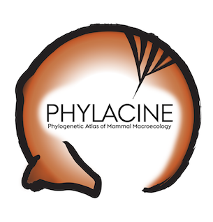

## Welcome to the home of PHYLACINE, a global database for late Quaternary mammals.

PHYLACINE is a database that features:
- Trait data (mass, diet, life habit)
- Island endemicity
- IUCN threat status
- Phylogenetic trees
- Current ranges
- Counterfactual present natural ranges
  
  ...for all extant and recently extinct mammal species.

### Download the data
To download the latest stable version of PHYLACINE (Version 1.2) or to read our detailed metadata, vist our archive on DataDryad **(This link will go live once the manuscript has been published)**.

### Try out the data
We have some example [code](../README.md#vignette) at our GitHub site to help you easily create a map and phylogeny of Australian megafauna. 

### Cite the data
To cite PHYLACINE, please use the following:
>Faurby, S., Davis, M., Pedersen, R. Ø., Schowanek, S. D., Antonelli, A., & Svenning, J.C. (In Review). PHYLACINE 1.2: The Phylogenetic Atlas of Mammal Macroecology. Ecology.

### Report errors
If you have an error to report or a suggestion to improve the database, please contact us through this [form](https://docs.google.com/forms/d/e/1FAIpQLSeo0vEbt7IO6DV0FXLt8wzgXVXEcw2lYHzJeItbA_CiM-PjSw/viewform?usp=sf_link).

### Check out our Most Wanted List
You can also help us out by taking a look at our [Most Wanted List](Most_wanted_list.csv) of species with missing data. Recognize any names and know where we could find data about their diet or body mass? Please drop us a [line](https://docs.google.com/forms/d/e/1FAIpQLSeo0vEbt7IO6DV0FXLt8wzgXVXEcw2lYHzJeItbA_CiM-PjSw/viewform?usp=sf_link). Species with large ranges and imprecise phylogenetic imputations are ranked highest.

### Help develop the next version of PHYLACINE
If you would like to see the latest development version of PHYLACINE or start a pull request, please visit our [GitHub repo](https://github.com/MegaPast2Future/PHYLACINE_1.2) **(This link will go live once the manuscript has been published)**.

------

PHYLACINE 1.2 is a product of MegaPast2Future, a multidisciplinary, international working group housed at Aarhus University in Denmark. If you would like to know more about us, visit our [main page](http://projects.au.dk/mega/). If you are interested in other work we are doing on GitHub, check out our [GitHub site](https://megapast2future.github.io).
